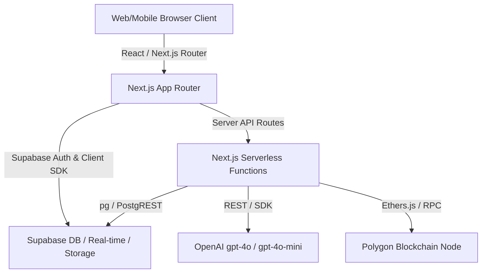
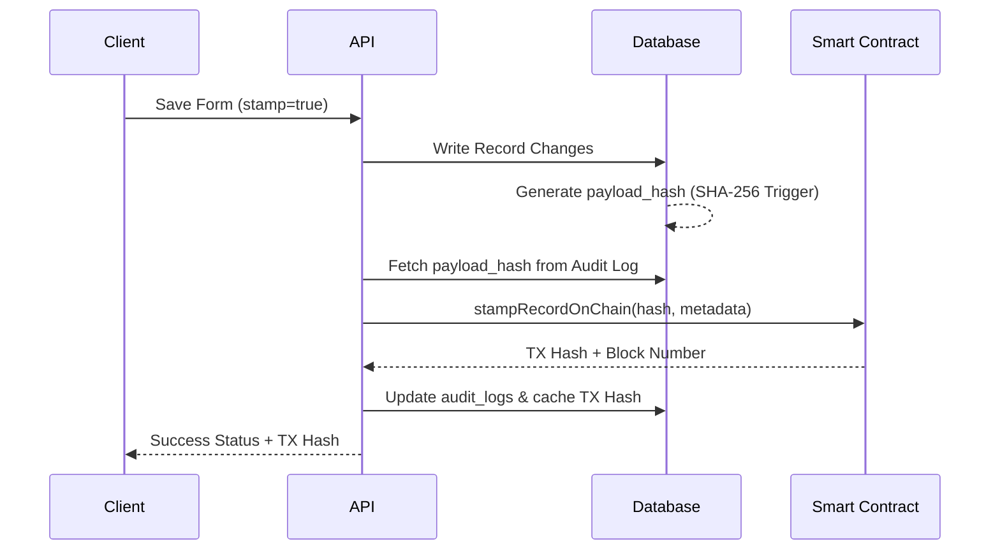

# System Architecture

This document describes the high-level software architecture, data flows, and design patterns used in the HMO Management Application.

---

## 1. Structural Overview

The application is structured as a standard full-stack **Next.js 14 App Router** application deployed on Vercel, integrating with **Supabase (PostgreSQL)** for persistence, **OpenAI** for AI intelligence (cognitive processing), and the **Polygon Blockchain** for cryptographic auditing.

---

## 2. Frontend Layout & Responsive Design

### Desktop Layout
On desktop viewports (`xl:flex`), the workspace displays as a side-by-side three-column view:
1. **Left Sidebar:** Navigation menu and real-time active tenants list.
2. **Center Panel:** Renders the main active view (e.g. `DashboardView`, `SessionsView`, `LedgerView`, or the active form workspace `FormWorkspace`).
3. **Right Panel:** A collapsible workspace drawer (`FormsPanel`) displaying the forms library checklist or the `AIBrainPanel` chat interface.

### Mobile Layout System (Dynamic Tab Switcher)
On viewports smaller than `xl` (mobile and tablet), stacking all panels vertically results in cramped scrolling and poor keyboard entry. The app resolves this by implementing a **Segmented Mobile Tab Switcher** at the page level.

* **Tabs:** `Editor` | `Forms Library` | `AI Brain`
* **Behavior:** Clicking a tab dynamically displays ONLY that component at full height (`h-full` / `h-[100dvh]`), hiding the others completely:
  * **Editor Active:** Displays the active form `FormWorkspace` full screen.
  * **Forms Library Active:** Displays the checklist in `FormsPanel` full screen. Selecting a form automatically redirects focus back to the `Editor` tab.
  * **AI Brain Active:** Displays the `AIBrainPanel` full screen, maximizing vertical space for reading chat history and typing messages via the virtual keyboard.

---

## 3. Database Layer & Security (RLS)

The database runs on **PostgreSQL via Supabase**. Security is strictly enforced using **Row-Level Security (RLS)** rules at the database engine level, safeguarding tenant PII from unauthorized reads or modifications.

### Core Tables
1. `users`: Stores staff profiles (name, email, role: `Manager` | `SupportWorker`, and brand).
2. `tenants`: Primary record for residents, including contact info, DOB, NINO, benefits, and status (`active`, `inactive`, `missing`).
3. `sessions`: Daily/weekly/monthly session logs recorded by support workers.
4. `service_charges`: Service charge invoice records tracking amounts owed, paid, and dates.
5. `audit_logs`: Immutable log of edits and saves containing the record ID, user, timestamp, and a SHA-256 payload hash.
6. `blockchain_stamps`: Cache tracking successfully submitted Polygon blockchain transactions linked to audit logs.

### RLS Policies
* **Managers:** Have global select, insert, update, and delete access on all records.
* **Support Workers:** Access is strictly bounded by active worker assignments in `worker_tenant_assignments`. Support workers can only read or write logs and sessions for tenants assigned to them.
* **Tenants:** Read-only access to their own profile and signing verification records.

---

## 4. AI Engine: Orchestration & RAG

AI services are coordinated by a central orchestrator class at [orchestrator.ts](file:///Users/user/Documents/VOREM-LABS/mattys-place/src/lib/ai/orchestrator.ts).

### Model Isolation
To prevent runtime 404s and maintain predictability, model references are locked strictly to OpenAI production models:
* **Chat Interactions:** `gpt-4o` (highly capable, supports tool calling loops).
* **Suggested Session Questions:** `gpt-4o-mini` (fast, economical).

### Retrieval-Augmented Generation (RAG) Flow
When a support worker inputs a prompt in the AI Brain:
1. **Context Extraction:** The system reads the tenant's profile metadata (DOB, NINO, moved-in dates, probation status).
2. **Semantic Search:** It queries the Supabase vector database for the top 4 most semantically relevant historical sessions.
3. **Prompt Composition:** The orchestrator embeds this context and past turns in a system instruction prompt.
4. **Execution:** The prompt is sent to `gpt-4o`.
5. **Guardrails:** Output checks analyze responses for risk indicators (safeguarding alerts, deterioration flags) or PII leaks before rendering.

---

## 5. Blockchain Auditing Layer

Every form save operation (when `stamp=true` is passed to `/api/forms/save`) triggers cryptographic verification.

1. The database computes a cryptographic SHA-256 hash of the modified record row.
2. The server-side API pulls this hash and invokes `stampRecordOnChain` on the `MattysPlaceAudit` smart contract deployed on the Polygon network.
3. The transaction receipt is retrieved, and the `blockchain_tx_id` is cached back to the database audit record, providing verifiable, immutable proof of compliance.
